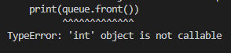

# 큐 18258

## key point

1. front는 맨 앞에 들어와서 맨 앞에 나가는 데이터를 가리키는 포인터.
2. rear는 맨 뒤에 다음 데이터가 들어올 자리를 가리키는 포인터.
3. size는 현재 배열의 갯수를 저장하는 변수.

## warning point

1. 문제의 pop, size 등의 키워드를 그대로 class의 method명으로 입력하지 말 것. `'int' object is not callable` 가 뜬다.

   

2. back을 구현할 때에는 `self.rear`에서 빼줘야 한다. 왜냐하면 이건 다음 들어올 자리를 가리키는 포인터기 때문에, 현재 존재하는 배열의 index는 -1 한 값이 될 것이기 때문이다.
