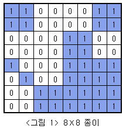
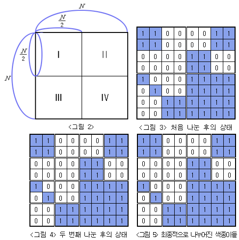

# 색종이 만들기 2630

### 문제

아래 <그림 1>과 같이 여러개의 정사각형칸들로 이루어진 정사각형 모양의 종이가 주어져 있고, 각 정사각형들은 하얀색으로 칠해져 있거나 파란색으로 칠해져 있다. 주어진 종이를 일정한 규칙에 따라 잘라서 다양한 크기를 가진 정사각형 모양의 하얀색 또는 파란색 색종이를 만들려고 한다.

전체 종이의 크기가 N×N(N=2k, k는 1 이상 7 이하의 자연수) 이라면 종이를 자르는 규칙은 다음과 같다.

전체 종이가 모두 같은 색으로 칠해져 있지 않으면 가로와 세로로 중간 부분을 잘라서 <그림 2>의 I, II, III, IV와 같이 똑같은 크기의 네 개의 N/2 × N/2색종이로 나눈다. 나누어진 종이 I, II, III, IV 각각에 대해서도 앞에서와 마찬가지로 모두 같은 색으로 칠해져 있지 않으면 같은 방법으로 똑같은 크기의 네 개의 색종이로 나눈다. 이와 같은 과정을 잘라진 종이가 모두 하얀색 또는 모두 파란색으로 칠해져 있거나, 하나의 정사각형 칸이 되어 더 이상 자를 수 없을 때까지 반복한다.

위와 같은 규칙에 따라 잘랐을 때 <그림 3>은 <그림 1>의 종이를 처음 나눈 후의 상태를, <그림 4>는 두 번째 나눈 후의 상태를, <그림 5>는 최종적으로 만들어진 다양한 크기의 9장의 하얀색 색종이와 7장의 파란색 색종이를 보여주고 있다.

입력으로 주어진 종이의 한 변의 길이 N과 각 정사각형칸의 색(하얀색 또는 파란색)이 주어질 때 잘라진 하얀색 색종이와 파란색 색종이의 개수를 구하는 프로그램을 작성하시오.

### 입력

첫째 줄에는 전체 종이의 한 변의 길이 N이 주어져 있다. N은 2, 4, 8, 16, 32, 64, 128 중 하나이다. 색종이의 각 가로줄의 정사각형칸들의 색이 윗줄부터 차례로 둘째 줄부터 마지막 줄까지 주어진다. 하얀색으로 칠해진 칸은 0, 파란색으로 칠해진 칸은 1로 주어지며, 각 숫자 사이에는 빈칸이 하나씩 있다.

### 출력

첫째 줄에는 잘라진 햐얀색 색종이의 개수를 출력하고, 둘째 줄에는 파란색 색종이의 개수를 출력한다.

---

# my key point

1. 재귀로 사분면을 나눌 때 x, y좌표와 길이(n)를 함수의 인수로 한다. `cut(x,y,n)`
2. 재귀에서 판별이 필요할 때에는 재귀적으로 어떻게 판별기준을 세울 수 있는지 생각하자. `color=data[x][y]`
3. 재귀로 이중loop도 쓸 수 있구나.
4. global 변수 잘 생각해보기.
5. 이중리스트와 좌표, 사분면 관련 고민
6. 재귀 함수 내에서 언제 return 할 지
7. 문제가 요구하는 것을 구하는 방법(white, blue)
